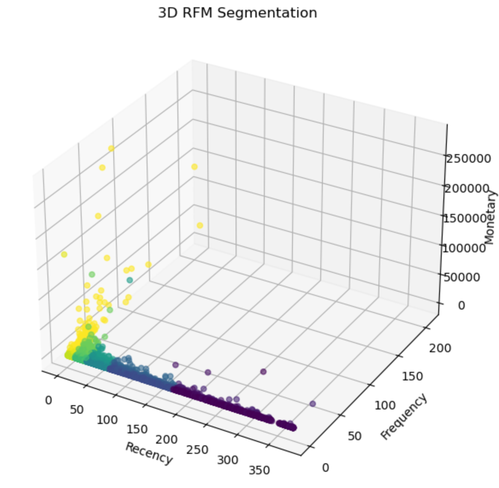
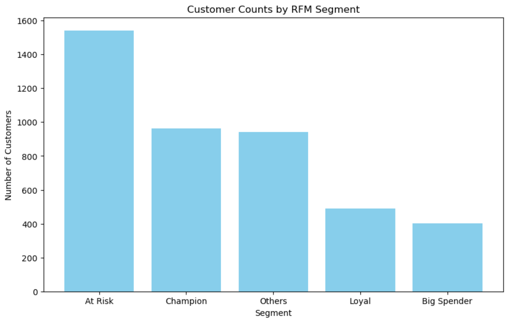

# Customer Segmentation and CLV Analysis Project

**Date:** April 21, 2025  
**Dataset:** UCI Online Retail Dataset  
**Author:** Avinab

---

## Project Overview

This project delivers a comprehensive customer segmentation and Customer Lifetime Value (CLV) analysis for a retail business using the UCI Online Retail dataset. The analysis leverages RFM (Recency, Frequency, Monetary) modeling and probabilistic CLV modeling (BG/NBD and Gamma-Gamma) to identify actionable customer segments and drive targeted business strategies.

---

## RFM Segment Summary

| Segment      | Recency (Median) | Frequency (Median) | Monetary (Median) | Key Characteristics                 | Recommended Action                   |
|--------------|------------------|--------------------|-------------------|-------------------------------------|--------------------------------------|
| Champion     | Lowest           | Highest            | Highest           | Recent, frequent, high spenders     | Retain with VIP rewards, exclusives  |
| Big Spender  | Moderate         | High               | Very High         | High spend, less recent/frequent    | Upsell, premium offers               |
| Loyal        | Very Low         | High               | Moderate          | Frequent, recent, moderate spend    | Loyalty incentives, cross-sell       |
| At Risk      | High             | Low                | Low               | Not recent, low frequency/spend     | Win-back campaigns, re-engagement    |
| Others       | Moderate         | Moderate           | Moderate          | Average on all metrics              | Nurture, monitor for upgrades        |

---

## CLV Segmentation & Strategic Recommendations

| Segment | Customer Count | Revenue Share (%) | Key Characteristics | Recommended Action |
| :-- | :-- | :-- | :-- | :-- |
| High CLV | 948 | 99.67 | Top 1/3 of customers, drive nearly all revenue | Elite retention, VIP rewards, white-glove service |
| Medium CLV | 948 | 0.33 | Consistent but lower-value spenders | Targeted upgrades, loyalty benefits, efficient marketing |
| Low CLV | 949 | 0.000024 | Largest by count, negligible revenue | Minimal investment, automated engagement, review viability |


---

## Implementation Priority

1. **Immediate (0-30 days):**
   - Launch elite account management for High CLV customers.
   - Review pricing/service models for profitability.
2. **Short-term (30-90 days):**
   - Deploy early warning system for High CLV activity.
   - Launch exclusive rewards program for High segment.
3. **Medium-term (90-180 days):**
   - Profile High CLV customers for deeper insights.
   - Reallocate resources from Low to High segments.

---

## Performance Metrics

- **High CLV retention rate:** Target >95%
- **Medium-to-High conversion:** Target 5% quarterly
- **High CLV share of wallet:** Target +10% increase
- **Cost-to-serve ratio:** Align with revenue contribution

---

## Visualizations

- **Customer Counts by RFM Segment:**  
  
- **3D RFM Segmentation:**  
  

---

## How to Run

1. Clone the repo and install dependencies:
    ```
    pip install -r requirements.txt
    ```
2. Place the dataset in the `data/` folder.
3. Run `rfm_analysis.ipynb` for RFM segmentation.
4. Run `clv_analysis.ipynb` for CLV modeling and business recommendations.

---

## Conclusion

This project demonstrates how advanced customer analytics can reveal critical revenue patterns and guide resource allocation. By focusing on High CLV customers and using targeted strategies for each segment, the business can maximize retention, profitability, and sustainable growth.
